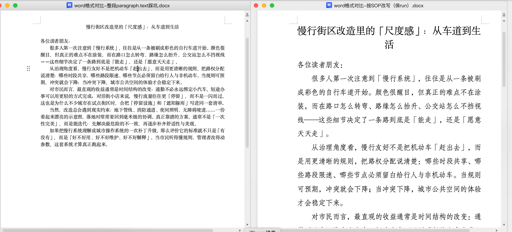

# AI-Word-Skill

**简体中文 (Simplified Chinese):** [README.zh-CN.md](README.zh-CN.md)

### Before you read: real Word, same story — two edit paths

<p align="center">
  
</p>

| Lens | **Left — pitfall (`paragraph.text =`)** | **Right — SOP (`rewrite_paragraph`, keep `runs[0]`)** |
|------|------------------------------------------|--------------------------------------------------------|
| What you see | Dense “wall of text”; title blends into body; weak hierarchy | Large centered title, clearer salutation/body rhythm, readable spacing — **template intent survives** |
| Why | `python-docx` tends to **rebuild runs** and drop the `rPr` you depended on | Put new text in **`runs[0]`**, clear other runs — the **first run’s** fonts & paragraph marks anchor the look |

**Automated mini-preview** (does not replace the hero image): `python scripts/render_readme_compare_figure.py` → `docs/images/readme-compare-autogen-quicklook.png` (macOS Quick Look). Core pair generator: [`scripts/compare_sop_vs_paragraph_text.py`](scripts/compare_sop_vs_paragraph_text.py) + [`scripts/build_demo_template.py`](scripts/build_demo_template.py).

<a id="tldr"></a>
## TL;DR: pain points, what this repo fixes, why it matters

### I. What usually goes wrong when you let AI edit Word directly

- **Semantics:** the draft reads like it “mostly makes sense.”
- **Layout:** you open the file and it looks like a **different person did the layout**—misaligned blocks, mixed CJK/Latin fonts, drifting spacing before/after paragraphs and line spacing, odd heading/list levels, or the whole document falling back to **Calibri**; after a few rounds, every export is “almost” like the template but not quite.
- **Structure:** text in **tables, headers/footers, and text boxes** is not updated, or your toolchain never sees it—leaving a **half-old, half-new** landmine.
- **Collaboration:** **trust and rework cost** suffer on delivery—you end up explaining not the substance, but **“why the format changed again.”**

### II. What this Skill (this repo) is for

1. **Separate “changing words” from “destroying layout”:** edit a **copy of an already-styled** `.docx` template; avoid building from `Document()` from scratch and avoid wholesale `paragraph.text = ...` patterns that commonly wipe `rPr`.
2. **A copy-pasteable engineering order:** single-run replace → cross-run replace → full-paragraph rewrite (keep first run) → `deepcopy` to insert paragraphs → **walk tables in parallel**.
3. **Something you can eyeball:** the script builds two files from the same template—**“SOP rewrite” vs “whole-paragraph assignment pitfall”**—open them side by side in Word to **see exactly where the difference comes from.**

### III. Value and core stance

| Dimension | Value |
|-----------|--------|
| **Time** | fewer full-document re-layouts or painful manual alignment passes |
| **Quality** | for contracts, minutes, official docs, and bids, **stable layout ≈ professionalism** |
| **Explainability** | failures map to **OOXML / runs / styles**, not magic |
| **Core lever** | **template copy + change `run.text` when possible (clear sibling runs if needed) + do not skip tables**—that is this repo’s technical position |

**Stack:** primarily **`python-docx`**; deeper notes live under [`docs/`](docs/).

---

## Contents

0. [TL;DR (pain / fix / value)](#tldr)  
1. [Problem and root cause (OOXML mental model)](#1-problem-and-root-cause-ooxml-mental-model)  
2. [Anti-patterns: three common ways to break layout](#2-anti-patterns-three-common-ways-to-break-layout)  
3. [Correct workflow (golden path)](#3-correct-workflow-golden-path)  
4. [Playbook: easy to hard](#4-playbook-easy-to-hard)  
5. [Inserting paragraphs (`deepcopy` + `w:sectPr` anchor)](#5-inserting-paragraphs-deepcopy--wsectpr-anchor)  
6. [Tables, headers/footers, text boxes](#6-tables-headersfooters-text-boxes)  
7. [What the comparison script does](#7-what-the-comparison-script-does)  
8. [Pre-delivery checklist](#8-pre-delivery-checklist)  
9. [Relationship to Pandoc](#9-relationship-to-pandoc)  
10. [Limits and boundaries](#10-limits-and-boundaries)  
11. [Quick start](#11-quick-start)  
12. [License and disclaimer](#12-license-and-disclaimer)

---

## 1. Problem and root cause (OOXML mental model)

### 1.1 What you are seeing (symptoms)

You ask AI to edit or generate a Word file; **the body reads mostly fine**, but the layout looks like “someone else typeset it”: misalignment, mixed fonts, drifting indents, odd heading levels, or everything defaulting to Calibri—**looks AI-generated, feels awkward in real meetings.**

The essence: **the words are right, but the layout carriers underneath (runs, paragraph styles, paragraph properties) were torn down or reset to defaults by the toolchain**, so visually it looks like a full re-layout.

### 1.2 Root cause (structure: OOXML)

A `.docx` is **ZIP + OOXML (XML)**. A paragraph you see in Word is usually:

- one paragraph **`w:p`**
  - multiple text runs **`w:r`**
    - each run can carry **`w:rPr`**: eastAsian font, Latin font, size, bold, color, language tags, etc.
  - the paragraph also has **`w:pPr`**: alignment, spacing before/after, line spacing, style references, etc.

So:

- **First half Song, second half bold** in one paragraph is usually **multiple runs**, not one flat string.
- **Layout drift** is mostly **rebuilt run structure** or **new paragraphs on default styles**, not “wrong characters.”

`paragraph.runs` in `python-docx` maps to that `w:r` sequence; **changing `run.text` usually keeps that run’s `rPr`**—that is why this repo pushes “template + run-level edits.”

---

## 2. Anti-patterns: three common ways to break layout

### 2.1 `paragraph.text = "new full text"`

`python-docx` often **removes existing `w:r` under the paragraph and creates a new run**. Result:

- paragraph-level `pPr` may survive, but **run-level `rPr` (especially eastAsian fonts and mixed scripts) is easy to lose**
- the paragraph no longer matches other **hand-typeset** paragraphs in the same file

**Conclusion:** unless you are sure the paragraph only needs default formatting, do not use whole-paragraph assignment as your bulk main path.

### 2.2 `Document()` from scratch + `add_paragraph(...)`

New paragraphs usually land on **Normal / default styles**—CJK/Latin fonts, spacing before/after, and numbering drift from the template.

**Conclusion:** do not assemble the main deliverable from an empty `Document()`; **start from an existing styled `.docx`.**

### 2.3 Only walking `doc.paragraphs`, ignoring `doc.tables`

Table cells use the same `paragraph` / `run` structure. Fixing body text only leaves “perfect outside the table, stale inside.”

**Conclusion:** **body + tables**—two channels.

---

## 3. Correct workflow (golden path)

```
shutil.copy(template.docx, output.docx)
doc = Document("output.docx")
# only: run.text / rewrite_paragraph / deepcopy insert / table walk
doc.save("output.docx")
```

**One-liner:** **Copy the file → edit text inside runs on the copy → save.**  
The template can be an official letterhead, a contract layout sample, finalized meeting minutes, or any file that **already looks right in Word.**

---

## 4. Playbook: easy to hard

### 4.1 Single-run replace (preferred)

When `old` fully sits inside one `run.text`:

```python
def replace_in_paragraph(paragraph, old_text, new_text) -> bool:
    for run in paragraph.runs:
        if old_text in run.text:
            run.text = run.text.replace(old_text, new_text)
            return True
    return False
```

**Use for:** placeholders, batch proper-noun fixes, most cases where Word **did not split the match across runs.**

### 4.2 Cross-run replace (essential)

Word may split **one word** across two runs (pinyin, track changes, paste from mixed sources). Then you:

1. Join the paragraph: `''.join(r.text for r in paragraph.runs)`
2. Find the span of `old_text`, map back to run indices
3. **Write merged text into the first run**, **clear** the other affected runs (avoid duplicate output)

Full implementation: [`docs/sop-python-docx-preserve-formatting.md`](docs/sop-python-docx-preserve-formatting.md) section 2.3, `replace_cross_runs`.

**Rule of thumb:** if the text is “obviously there” but `replace` never fires, suspect **cross-run** first.

### 4.3 Full-paragraph rewrite: `rewrite_paragraph` (minutes / full clause replace)

When you must replace the whole paragraph but still inherit the **first run’s** font DNA:

```python
def rewrite_paragraph(paragraph, new_text: str) -> None:
    if not paragraph.runs:
        return
    paragraph.runs[0].text = new_text
    for run in paragraph.runs[1:]:
        run.text = ""
```

**Meaning:**

- **Keep** `runs[0]`’s `rPr` (common: body first run Song / size)
- **Clear** the rest to avoid stray fragments

**Risk:** if the paragraph used multiple runs for **intra-paragraph bold**, that structure is gone after rewrite—trade-off: batch layout work usually prefers **paragraph-level consistency**; intra-paragraph mix needs XML work or a template that pre-merges styles.

### 4.4 Whole-document replace (paragraphs + tables)

```python
def replace_all(doc, old: str, new: str) -> int:
    n = 0
    for p in doc.paragraphs:
        for run in p.runs:
            if old in run.text:
                run.text = run.text.replace(old, new)
                n += 1
    for table in doc.tables:
        for row in table.rows:
            for cell in row.cells:
                for p in cell.paragraphs:
                    for run in p.runs:
                        if old in run.text:
                            run.text = run.text.replace(old, new)
                            n += 1
    return n
```

**Note:** `python-docx` has limited support for **nested tables** and some complex layouts; if you “cannot reach” a piece of text, fall back to OOXML or fix the template in Word.

---

## 5. Inserting paragraphs (`deepcopy` + `w:sectPr` anchor)

`doc.add_paragraph()` may:

- reference a style name that does not exist → `KeyError`
- even when it works, styles often do not match the template

**Recommended:** pick a well-typeset paragraph from the template, `deepcopy` its `_element` (`w:p`), clear `w:r`, then `deepcopy` a template `w:r`, set new text, insert **before `w:sectPr`** in the body.

**Ordering traps:**

- `target.addprevious(new_p)` in a loop can reverse order
- safer: `addnext` + **move the anchor** after each insert

Details: [`docs/sop-python-docx-preserve-formatting.md`](docs/sop-python-docx-preserve-formatting.md) section 4.

---

## 6. Tables, headers/footers, text boxes

| Area | `python-docx` capability | Practical advice |
|------|----------------------------|------------------|
| Main-body tables `doc.tables` | most normal tables are walkable | walk in sync; merged cells may reuse `cell` objects |
| Headers/footers | limited / situational | keep templates stable; backup before edits; heavy cases → OOXML or Word automation |
| Text boxes / text in shapes | often outside `paragraphs` | unpack `word/document.xml` or avoid putting critical fields only in text boxes |

---

## 7. What the comparison script does

Script: [`scripts/compare_sop_vs_paragraph_text.py`](scripts/compare_sop_vs_paragraph_text.py)

1. Reads your **`--template`** (must be a **pre-styled** `.docx`).
2. **Copies twice:**
   - `compare-sop-rewrite-paragraph.docx`: calls `rewrite_paragraph` on selected paragraph indices
   - `compare-bad-paragraph-text.docx`: same indices, `paragraph.text = ...`
3. Open both in Word **side by side** and compare fonts, line spacing, and run-level differences.

**Important limitation:** `BLOCKS` in the script writes by **paragraph index** (0, 2, 3, …). If your template’s paragraph count/order differs, edit `BLOCKS` or switch to “find by paragraph text signature” before rewriting.

```bash
python3 -m venv .venv && source .venv/bin/activate
pip install -r requirements.txt

python scripts/compare_sop_vs_paragraph_text.py \
  --template /path/to/your-template.docx \
  --out-dir ./out
```

---

## 8. Pre-delivery checklist

- [ ] Search the document for leftover placeholders / old company names / old project codes (you can `rg` inside unpacked `word/document.xml`).
- [ ] Spot-check the first N paragraphs: does `runs[0]`’s `font.name` / `font.size` match the template (sampling only—some properties live only in XML).
- [ ] Tables fully updated? spot-check random cells.
- [ ] Save a “single change” diff file for a business reviewer to eyeball.

---

## 9. Relationship to Pandoc

`pandoc --reference-doc=template.docx` is **not** the same as in-place text edits on the template: Pandoc remaps structure; CJK indents, lists, and style names can still drift.

**Suggestion:**

- **Strong layout parity** → use this repo’s golden path (`shutil.copy` + run-level `python-docx`).
- **Weak layout / internal drafts** → Pandoc is fine when you accept the deviation.

---

## 10. Limits and boundaries

- `python-docx` is **not** a Word typesetter: complex layout, content controls, fields, revision mode—either avoid or use COM / AppleScript / manual Word.
- **Track Changes** is not in scope by default.
- Never commit secrets, internal paths, or client materials into public examples.

---

## 11. Quick start

```bash
git clone https://github.com/sgsss998/AI-Word-Skill.git
cd AI-Word-Skill

python3 -m venv .venv
source .venv/bin/activate  # Windows: .venv\Scripts\activate
pip install -r requirements.txt

python scripts/compare_sop_vs_paragraph_text.py \
  --template ./your-template.docx \
  --out-dir ./out
```

## 12. License and disclaimer

- **License:** MIT — see [`LICENSE`](LICENSE).
- **Disclaimer:** this repository is technical workflow and sample code only, not legal advice; verify before commercial use.

---

## Further reading (in-repo)

- [`docs/overview.md`](docs/overview.md) — readable overview (Chinese)
- [`docs/sop-python-docx-preserve-formatting.md`](docs/sop-python-docx-preserve-formatting.md) — deep technical appendix (Chinese): replace / cross-run / rewrite / insert / tables / checklist
