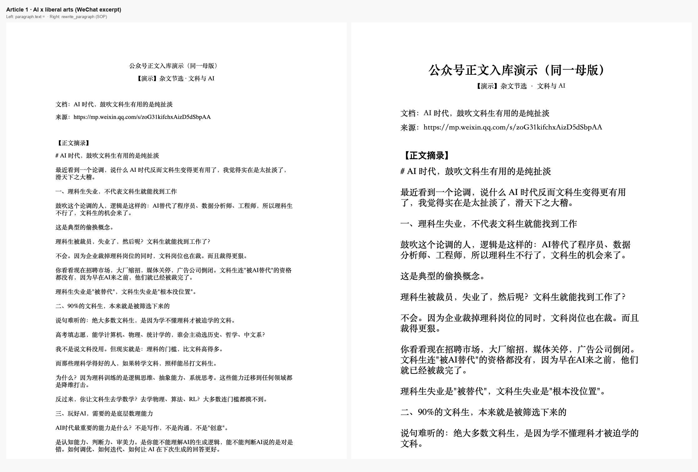
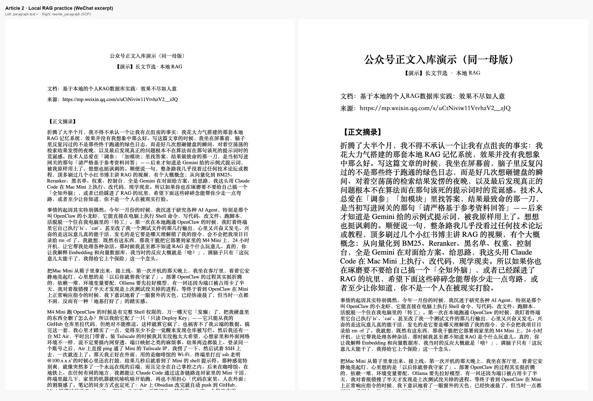

# AI-Word-Skill

**English (default):** [README.md](README.md)

### 先看图：真机 Word 并排，同一篇正文，两种改法

<p align="center">
  
</p>

| 对比 | **左：踩坑（`paragraph.text =`）** | **右：SOP（`rewrite_paragraph`，保首 run）** |
|------|-------------------------------------|---------------------------------------------|
| 观感 | 标题缩成正文、段距挤成“字墙”，层次弱 | 大标题居中、称呼与正文节奏清楚，**母版版式意图还在** |
| 原因 | `python-docx` 往往**重建 run**，你依赖的 `rPr` 容易丢 | 新正文写进 **`runs[0]`**，其余 run 清空 —— **首 run** 的字号/字体/段落标记托住观感 |

**自动小图预览**（不覆盖上方主图）：macOS 上 `python scripts/render_readme_compare_figure.py` → `docs/images/readme-compare-autogen-quicklook.png`。成对 docx：[`scripts/compare_sop_vs_paragraph_text.py`](scripts/compare_sop_vs_paragraph_text.py)、演示母版：[`scripts/build_demo_template.py`](scripts/build_demo_template.py)。

### 两篇公开公众号文 → 同一套会议纪要母版 → 两种写入方式

**AI干货家老明** 两篇原文（清洗后的节选，见 [`demo/article-sources/`](demo/article-sources/)）写入**同一份**已排版 `.docx`：**左** `paragraph.text =`，**右** `rewrite_paragraph`（SOP）。下图由 macOS Quick Look 对脚本成对导出的 `.docx` 生成（[`scripts/build_wechat_article_pairs.py`](scripts/build_wechat_article_pairs.py)）。

**第一篇** — [AI 时代，鼓吹文科生有用的是纯扯淡](https://mp.weixin.qq.com/s/zoG31kifchxAizD5dSbpAA)

<p align="center">
  
</p>

**第二篇** — [基于本地的个人RAG数据库实践：效果不尽如人意](https://mp.weixin.qq.com/s/uCtNiviw11VtvhzV2__zJQ)

<p align="center">
  
</p>

**复现 docx 成对文件**（母版路径换成本机绝对路径）：  
`python scripts/build_wechat_article_pairs.py --template "/你的路径/sop 测试母版-模板.docx" --out-dir demo/out-wechat`

<a id="tldr"></a>
## 开篇：痛点、本仓库解决什么、为什么值得看

### 一、日常直接用 AI 编辑 Word，你通常会撞上什么问题

- **语义层面**：AI 改完读起来“好像没问题”。  
- **版式层面**：一打开就像**换了个排版师**——这里对不齐、那里中英文字体串味、段前段后与行距漂移、标题/编号层级怪怪的，甚至整篇落回 **Calibri**；多改几轮，每一版和母版都“差一点”。  
- **结构层面**：**表格、页眉页脚、文本框**里的字没同步改到，或工具链根本扫不到，留下“半新半旧”的雷。  
- **协作层面**：对内对外交付时，**可信度与返工成本**都吃亏——你要解释的不是观点，而是“为什么格式又变了”。

### 二、本 Skill（本仓库）主要解决哪些问题

1. **把“改字”和“毁版式”拆开**：在**已有格式母版**的 `.docx` 副本上改内容，避免 `Document()` 从零拼、避免整段 `paragraph.text =` 这类常见毁 `rPr` 写法。  
2. **给一套可照抄的工程顺序**：单 run 替换 → 跨 run 替换 → 整段重写（保留首 run）→ `deepcopy` 插入段落 → **同步遍历表格**。  
3. **给可验收的对照物**：脚本在同一母版上生成 **“SOP 改写”vs“整段赋值踩坑”** 两份文件，用 Word 并排打开，**一眼看清差异从哪来**。

### 三、为什么有价值、核心价值点在哪

| 维度 | 价值 |
|------|------|
| **时间** | 少做一整轮“全篇重排”或“手工对齐到哭” |
| **质量** | 合同、纪要、公文、标书等场景下，**版式稳定≈专业度** |
| **可解释** | 出问题能对上 **OOXML / run / 样式** 的原因，不靠玄学 |
| **核心抓手** | **母版副本 + 尽量只动 `run.text`（必要时清空同段其余 run）+ 表格别漏**——这是本仓库的技术立场 |

**技术栈**：以 **`python-docx`** 为主；附录见 [`docs/`](docs/)。

---

## 目录

0. [开宗明义（痛点 / 解决什么 / 价值）](#tldr)  
1. [问题与根因（OOXML 心智模型）](#1-问题与根因ooxml-心智模型)  
2. [反模式：三种最常见的毁版式写法](#2-反模式三种最常见的毁版式写法)  
3. [正确工作流（黄金路径）](#3-正确工作流黄金路径)  
4. [操作手册：从易到难](#4-操作手册从易到难)  
5. [插入新段落（`deepcopy` + `w:sectPr` 锚点）](#5-插入新段落deepcopy--wsectpr-锚点)  
6. [表格、页眉页脚、文本框](#6-表格页眉页脚文本框)  
7. [本仓库对照脚本在做什么](#7-本仓库对照脚本在做什么)  
8. [交付前自检清单](#8-交付前自检清单)  
9. [与 Pandoc 的关系](#9-与-pandoc-的关系)  
10. [限制与边界](#10-限制与边界)  
11. [快速开始](#11-快速开始)  
12. [许可与免责](#12-许可与免责)

---

## 1. 问题与根因（OOXML 心智模型）

### 1.1 你到底遇到了什么问题（现象层）

让 AI 帮忙编辑、生成一份 Word 文档，**正文读起来没大问题**，但版式却像“换了个人排版”：这里对不齐、那里中英文字体串味、段落缩进漂移、标题层级怪怪的，甚至整篇默认成 Calibri……**一眼 AI，二手尴尬**。

这类问题的本质是：**字改对了，但 Word 底层的版式载体（run、段落样式、段落属性）被工具链无意间拆掉了或换成了默认值**，所以肉眼看起来就像换了一个排版师重排过一版。

### 1.2 根因（结构层：OOXML 心智模型）

`.docx` 本质是 **ZIP + OOXML（XML）**。你在 Word 里看到的一段连续文字，在 XML 里通常是：

- 一个段落 **`w:p`**  
  - 下面挂多个文字运行 **`w:r`（run）**  
    - 每个 run 可有独立的 **`w:rPr`（run 属性）**：中文字体（eastAsia）、西文字体、字号、加粗、颜色、语言标记等  
  - 段落本身还有 **`w:pPr`**：对齐、段前段后、行距、样式引用等  

因此：

- **同一段里前半宋体、后半加粗**：往往是 **多个 run**，不是一整段无结构的纯文本。  
- **版式漂移**多数是 **run 结构被重建** 或 **新段落走了默认样式**，而不是单纯“字写错了”。

`python-docx` 暴露的 `paragraph.runs` 基本对应上述 `w:r` 序列；**改 `run.text` 通常保留该 run 的 `rPr`**——这也是本仓库主张“母版 + run 级改写”的技术出发点。

---

## 2. 反模式：三种最常见的毁版式写法

### 2.1 `paragraph.text = "新全文"`

`python-docx` 在实现上往往会 **清掉该段下原有 `w:r` 再新建 run**。结果是：

- 段落级 `pPr` 可能还在，但 **run 级 `rPr`（尤其 eastAsia 字体、混排）容易丢失**  
- 与同一文档里其它“手工排版段”观感不一致  

**结论**：除非你很确定该段只需要默认格式，否则不要用整段赋值做批量主路径。

### 2.2 `Document()` 从零新建 + `add_paragraph(...)`

新段落通常落在 **Normal / 默认样式**，中英文字体、段前后距、编号样式很容易和母版不一致。

**结论**：主交付物不要从空 `Document()` 拼出来；**应以现成 docx 为母版**。

### 2.3 只遍历 `doc.paragraphs`，忽略 `doc.tables`

表格单元格里同样是 `paragraph` / `run` 结构。只改正文会留下“表格外完美、表格里还是旧文案”。

**结论**：正文 + **表格**双通道遍历。

---

## 3. 正确工作流（黄金路径）

```
shutil.copy(格式母版.docx, 输出.docx)
doc = Document("输出.docx")
# 仅改 run.text / rewrite_paragraph / deepcopy 插入 / 表格遍历
doc.save("输出.docx")
```

**心法一句话**：**Copy 原档 → 在副本上改 run 里的字 → 保存。**  
母版可以是：公文模板、合同排版样例、会议纪要已定稿、任意“已在 Word 里调顺眼”的文件。

---

## 4. 操作手册：从易到难

### 4.1 单 run 内替换（优先）

当 `old` 完整落在某个 `run.text` 里时，直接替换：

```python
def replace_in_paragraph(paragraph, old_text, new_text) -> bool:
    for run in paragraph.runs:
        if old_text in run.text:
            run.text = run.text.replace(old_text, new_text)
            return True
    return False
```

**适用**：占位符替换、专有名词批量替换、绝大多数“没拆 run”的场景。

### 4.2 跨 run 替换（必备）

Word 可能把“一个词”拆到两个 run（例如拼音、修订、粘贴来源混排）。此时需要：

1. 拼出段落完整字符串：`''.join(r.text for r in paragraph.runs)`  
2. 找到 `old_text` 的字符区间，映射回涉及的 run 下标  
3. **合并文本写回第一个 run**，其余涉及 run **清空**（避免重复输出）

完整实现见 [`docs/sop-python-docx-preserve-formatting.md`](docs/sop-python-docx-preserve-formatting.md) 第 2.3 节 `replace_cross_runs`。

**经验**：凡是“明明在段落里却 `replace` 不到”优先怀疑 **跨 run**。

### 4.3 整段重写：`rewrite_paragraph`（会议纪要 / 合同某条全文替换）

当你必须整段替换，但仍希望继承该段“第一个 run”的字体 DNA：

```python
def rewrite_paragraph(paragraph, new_text: str) -> None:
    if not paragraph.runs:
        return
    paragraph.runs[0].text = new_text
    for run in paragraph.runs[1:]:
        run.text = ""
```

**语义**：

- **保留** `runs[0]` 的 `rPr`（常见：正文首 run 的宋体/小四）  
- **清空**其余 run，避免残留碎片字符  

**风险**：若该段原来靠多个 run 做“段内局部加粗”，重写后加粗结构会消失——这是取舍：版式批量生成通常优先“段级一致”，段内混排需改 XML 或接受母版预先合并样式。

### 4.4 全文档替换（段落 + 表格）

```python
def replace_all(doc, old: str, new: str) -> int:
    n = 0
    for p in doc.paragraphs:
        for run in p.runs:
            if old in run.text:
                run.text = run.text.replace(old, new)
                n += 1
    for table in doc.tables:
        for row in table.rows:
            for cell in row.cells:
                for p in cell.paragraphs:
                    for run in p.runs:
                        if old in run.text:
                            run.text = run.text.replace(old, new)
                            n += 1
    return n
```

**注意**：`python-docx` 对 **嵌套表格**、部分复杂版式的支持有限；遇到“改不到”要回到 OOXML 或手工在 Word 里调整母版。

---

## 5. 插入新段落（`deepcopy` + `w:sectPr` 锚点）

`doc.add_paragraph()` 可能：

- 引用不存在的样式名 → `KeyError`  
- 即使成功，也常与母版段落样式不一致  

**推荐**：从母版里挑一段版式正确的段落，取其 `_element`（`w:p`）`deepcopy`，清空 `w:r` 后，再 `deepcopy` 模板里的一个 `w:r` 写入新文本，插入到 `body` 中 **`w:sectPr` 之前**。

**插入顺序陷阱**：

- `target.addprevious(new_p)` 在循环里容易导致顺序反转  
- 更稳：`addnext` + **移动锚点**（每插一段，锚点变成新段）

详见 [`docs/sop-python-docx-preserve-formatting.md`](docs/sop-python-docx-preserve-formatting.md) 第 4 节。

---

## 6. 表格、页眉页脚、文本框

| 区域 | `python-docx` 能力 | 实务建议 |
|------|---------------------|----------|
| 主文档表格 `doc.tables` | 多数常规表可遍历 | 同步遍历；合并单元格注意 `cell` 复用 |
| 页眉页脚 | 支持有限 / 场景复杂 | 母版尽量固定；改动前备份；复杂需求考虑 OOXML 或 Word 自动化 |
| 文本框 / 图形内文字 | 常不在 `paragraphs` | 需要 unpacked docx 后处理 `word/document.xml` 或避免把关键字段放文本框 |

---

## 7. 本仓库对照脚本在做什么

脚本：[`scripts/compare_sop_vs_paragraph_text.py`](scripts/compare_sop_vs_paragraph_text.py)

1. 读入你提供的 **`--template`**（必须是一份**已有排版**的 `.docx`）。  
2. **复制两份**：  
   - `compare-sop-rewrite-paragraph.docx`：对指定段落索引调用 `rewrite_paragraph`  
   - `compare-bad-paragraph-text.docx`：对同索引调用 `paragraph.text = ...`  
3. 用 Word **左右分屏打开**，对比字体/行距/run 级差异。

**重要限制**：脚本里 `BLOCKS` 按 **段落索引**（0,2,3,…）写入。你的母版若段落数量/顺序不同，需要改 `BLOCKS` 或改为“按段落文本特征查找”再改写。

```bash
python3 -m venv .venv && source .venv/bin/activate
pip install -r requirements.txt

python scripts/compare_sop_vs_paragraph_text.py \
  --template /path/to/your-template.docx \
  --out-dir ./out
```

---

## 8. 交付前自检清单

- [ ] 全文检索旧占位符 / 旧公司名 / 旧项目代号是否残留（可在解压后的 `word/document.xml` 里 `rg`）。  
- [ ] 抽查前 N 段：`runs[0]` 的 `font.name` / `font.size` 是否与母版一致（仅抽样，因部分属性在 XML 里不全暴露给 API）。  
- [ ] 表格内是否替换完整（随机抽几个单元格）。  
- [ ] 另存一份“只改一处”的对照文件，给业务同事肉眼验收。  

---

## 9. 与 Pandoc 的关系

`pandoc --reference-doc=母版.docx` **不等于**在母版上原地改字：结构会被 Pandoc 重新映射，中文缩进/列表/样式名仍可能偏。

**建议**：

- **强版式一致** → 走本仓库的黄金路径（`shutil.copy` + `python-docx` run 级）。  
- **弱版式 / 内部草稿** → 可接受 Pandoc 偏差时再上 Pandoc。

---

## 10. 限制与边界

- `python-docx` **不是** Word 排版器：复杂版式、内容控件、域、修订模式等，要么绕开，要么上 COM/AppleScript/手工。  
- **修订模式（Track Changes）** 不是本仓库默认覆盖范围。  
- 任何脚本 **不要**把密钥、内网路径、客户材料写进公开示例。

---

## 11. 快速开始

```bash
git clone https://github.com/sgsss998/AI-Word-Skill.git
cd AI-Word-Skill

python3 -m venv .venv
source .venv/bin/activate  # Windows: .venv\Scripts\activate
pip install -r requirements.txt

python scripts/compare_sop_vs_paragraph_text.py \
  --template ./your-template.docx \
  --out-dir ./out
```

## 12. 许可与免责

- **许可**：MIT — 见 [`LICENSE`](LICENSE)。  
- **免责**：本仓库仅为技术流程与示例代码，不构成法律意见；商业使用前请自行复核。

---

## 延伸阅读（仓库内）

- [`docs/overview.md`](docs/overview.md) — 可读版总览  
- [`docs/sop-python-docx-preserve-formatting.md`](docs/sop-python-docx-preserve-formatting.md) — 附录级技术细则（replace / cross-run / rewrite / 插入 / 表格 / 自检）
